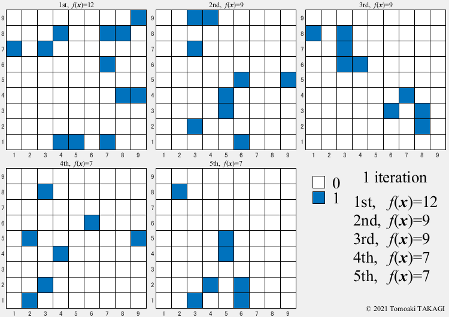
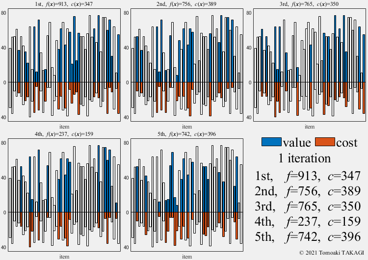
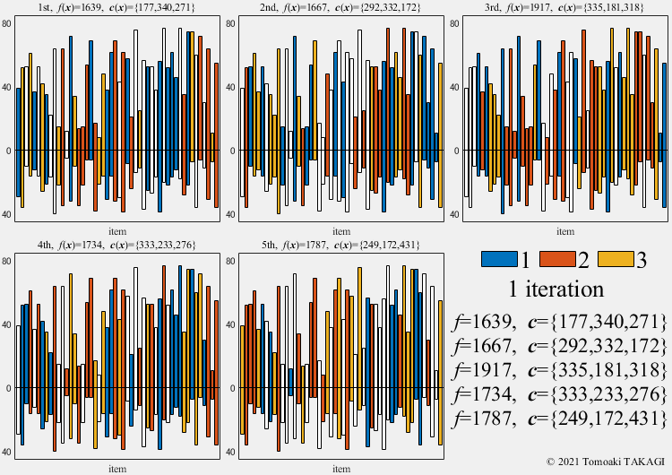

## GIF Animation
### OneMax problem:
$$ \text{Maxmize } f(\boldsymbol{x}) = \sum_{i=1}^n x_i$$&nbsp;&nbsp;&nbsp;&nbsp;$$x_i \in \{0,1\}$$&nbsp;&nbsp;&nbsp;&nbsp;$$f^*(\boldsymbol{x}) = (1,1,\dots,1)$$

### Extended OneMax problem:
$$ \text{Maxmize } f(\boldsymbol{x}) = \sum_{i=1}^n F(x_i)$$&nbsp;&nbsp;&nbsp;&nbsp;$$F(x_i) = \cases{1 & \text{if } x_i=1\cr 0 & \text{otherwise}}$$&nbsp;&nbsp;&nbsp;&nbsp;$$x_i \in \{0,1,\dots,5\}$$&nbsp;&nbsp;&nbsp;$$f^*(\boldsymbol{x}) = (1,1,\dots,1)$$

### 0/1 Knapsack problem:
Given a set of $$n$$ items, each with a value $$v_i$$ and a cost $$w_i$$, along with a maximum capacity $$W(=600)$$

$$ \text{Maxmize } f(\boldsymbol{x}) = \sum_{i=1}^n v_ix_i$$&nbsp;&nbsp;&nbsp;$$\text{Subject to } c(\boldsymbol{x}) = \sum_{i=1}^n w_ix_i \leq W$$&nbsp;&nbsp;&nbsp;$$x_i \in \{0,1\}$$

### Multiple  Knapsack problem:
Given a set of $$n$$ items, each with a value $$v_i$$ and a cost $$w_i$$, along with maximum capacitys $$\boldsymbol{W}(=\{500,300,100\})$$

$$ \text{Maxmize } f(\boldsymbol{x}) = \sum_{j=1}^3\sum_{i=1}^n v_iF(x_i,j)$$&nbsp;&nbsp;&nbsp;$$F(x_i,j) = \cases{1 & \text{if } x_i=j\cr 0 & \text{otherwise}}$$&nbsp;&nbsp;&nbsp;$$\text{Subject to } c_j(\boldsymbol{x}) = \sum_{i=1}^n w_iF(x_i,j) \leq W_j$$&nbsp;&nbsp;&nbsp;$$x_i \in \{0,1,2,3\}$$

### Ackley function:
$$ \text{Minimize } f(\boldsymbol{x}) = -20 \exp(-0.2 \sqrt{\frac{1}{n} \sum_{i=1}^n x_i^2}) - \exp(\frac{1}{n} \sum_{i=1}^n \cos(2\pi x_i)) + 20 + \exp(1)$$  
$$-5 \leq x_i \leq 5$$&nbsp;&nbsp;&nbsp;&nbsp;&nbsp;&nbsp;$$f^*(\boldsymbol{x}) = (0,0,\dots,0)=0 $$

### Rosenbrock function:
$$ \text{Minimize } f(\boldsymbol{x}) = \sum_{i=1}^{n-1} (100(x_{i+1}-x_i^2)^2+(1-x_i)^2)$$  
$$-5 \leq x_i \leq 5$$&nbsp;&nbsp;&nbsp;&nbsp;&nbsp;&nbsp;$$f^*(\boldsymbol{x}) = (1,1,\dots,1)=0 $$

### Sphere function:
$$ \text{Minimize } f(\boldsymbol{x}) = \sum_{i=1}^n x_i^2$$  
$$-5 \leq x_i \leq 5$$&nbsp;&nbsp;&nbsp;&nbsp;&nbsp;&nbsp;$$f^*(\boldsymbol{x}) = (0,0,\dots,0)=0 $$

## Javascript Animation
### Weight Vector Generation Method
You can change the weight vector size in the animation
* [Simplex-lattice design](animation/SLD.html){:target="_blank"}
* [Incremental lattice design](animation/ILD.html){:target="_blank"}
* [Riesz 𝑠-energy](animation/Energy.html){:target="_blank"}
* Hammersley method

### Weight Vector Change Method
You can change the weight vector distribution in the animation
* [Change method 1](animation/Change1.html){:target="_blank"}
* [Change method 2](animation/Change2.html){:target="_blank"}
* [Change method 3](animation/Change3.html){:target="_blank"}
* [Change method 4](animation/Change4.html){:target="_blank"}
* Normalized change method 1 (This distribution does not change)
* [Normalized change method 2](animation/NChange2.html){:target="_blank"}
* [Normalized change method 3](animation/NChange3.html){:target="_blank"}
* [Normalized change method 4](animation/NChange4.html){:target="_blank"}
