## GIF Animation
### OneMax problem:
$$ \text{Maxmize } f(\boldsymbol{x}) = \sum_{i=1}^n F(x_i) = \cases{1 & \text{if } x_i=1\cr 0 & \text{if } x_i=0}$$  
$$x_i \in \{0,1\}$$&nbsp;&nbsp;&nbsp;&nbsp;&nbsp;&nbsp;$$f^*(\boldsymbol{x}) = (1,1,\dots,1)$$

<a href="animation/OneMax.gif">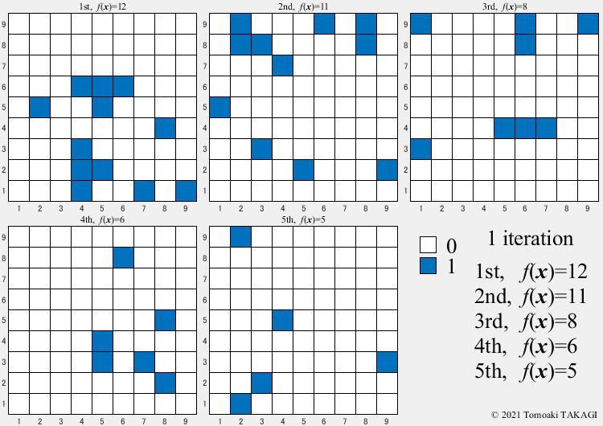</a>

### Extended OneMax problem:
$$ \text{Maxmize } f(\boldsymbol{x}) = \sum_{i=1}^n F(x_i) = \cases{1 & \text{if } x_i=1\cr 0 & \text{otherwise}}$$  
$$x_i \in \{0,1,\dots,5\}$$&nbsp;&nbsp;&nbsp;&nbsp;&nbsp;&nbsp;$$f^*(\boldsymbol{x}) = (1,1,\dots,1)$$

<a href="animation/OneMax2.gif">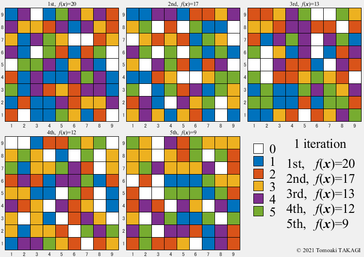</a>

### Ackley function:
$$ \text{Minimize } f(\boldsymbol{x}) = -20 \exp(-0.2 \sqrt{\frac{1}{n} \sum_{i=1}^n x_i^2}) - \exp(\frac{1}{n} \sum_{i=1}^n \cos(2\pi x_i)) + 20 + \exp(1)$$  
$$-5 \leq x_i \leq 5$$&nbsp;&nbsp;&nbsp;&nbsp;&nbsp;&nbsp;$$f^*(\boldsymbol{x}) = (0,0,\dots,0)=0 $$

&nbsp;&nbsp;Genetic Algorithm, GA&nbsp;&nbsp;&nbsp;&nbsp;&nbsp;&nbsp;Evolutionary Programming, EP&nbsp;&nbsp;&nbsp;&nbsp;&nbsp;&nbsp;EDA-PBIL
<a href="animation/AckleyGA.gif">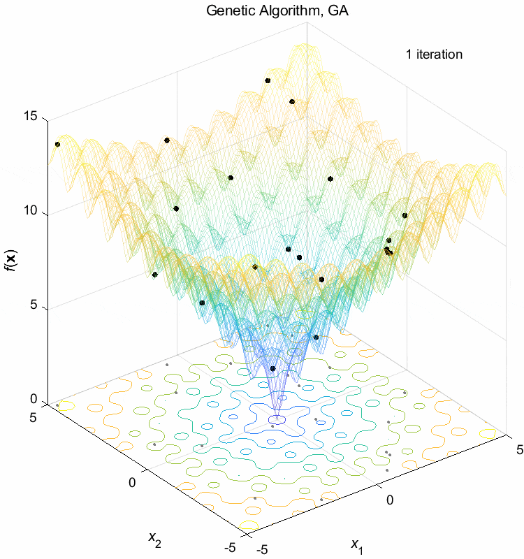</a><a href="animation/AckleyEP.gif">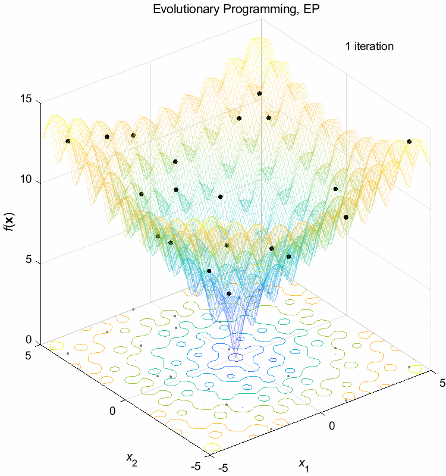</a>

&nbsp;&nbsp;Differential Evolution, DE&nbsp;&nbsp;&nbsp;&nbsp;&nbsp;&nbsp;Particle Swarm Optimization, PSO&nbsp;&nbsp;&nbsp;&nbsp;&nbsp;&nbsp;Ant System, AS  
<a href="animation/AckleyDE.gif">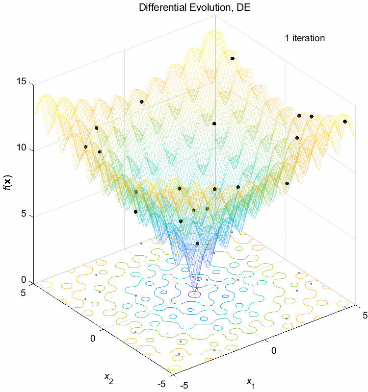</a><a href="animation/AckleyPSO.gif">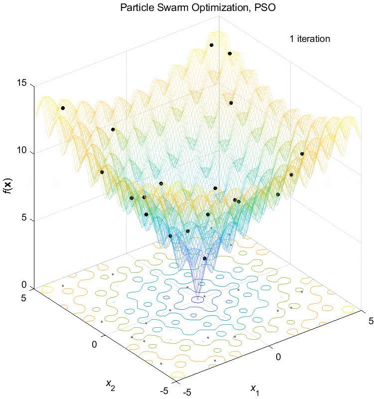</a>

### Rosenbrock function:
$$ \text{Minimize } f(\boldsymbol{x}) = \sum_{i=1}^{n-1} (100(x_{i+1}-x_i^2)^2+(1-x_i)^2)$$  
$$-5 \leq x_i \leq 5$$&nbsp;&nbsp;&nbsp;&nbsp;&nbsp;&nbsp;$$f^*(\boldsymbol{x}) = (1,1,\dots,1)=0 $$

&nbsp;&nbsp;Genetic Algorithm, GA&nbsp;&nbsp;&nbsp;&nbsp;&nbsp;&nbsp;Evolutionary Programming, EP&nbsp;&nbsp;&nbsp;&nbsp;&nbsp;&nbsp;EDA-PBIL
<a href="animation/RosenbrockGA.gif">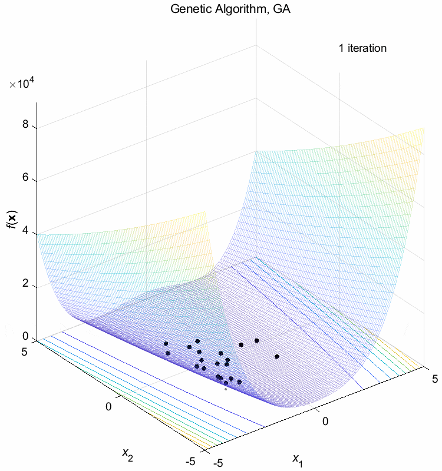</a><a href="animation/RosenbrockPBIL.gif">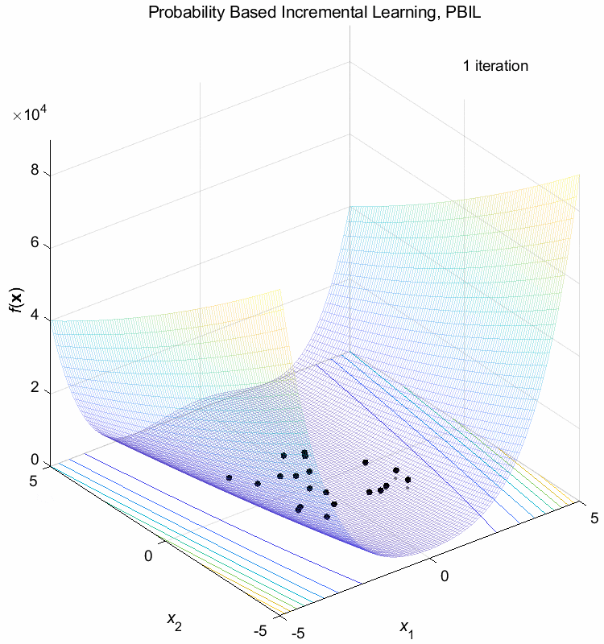</a>

&nbsp;&nbsp;Differential Evolution, DE&nbsp;&nbsp;&nbsp;&nbsp;&nbsp;&nbsp;Particle Swarm Optimization, PSO&nbsp;&nbsp;&nbsp;&nbsp;&nbsp;&nbsp;Ant System, AS  
<a href="animation/RosenbrockDE.gif">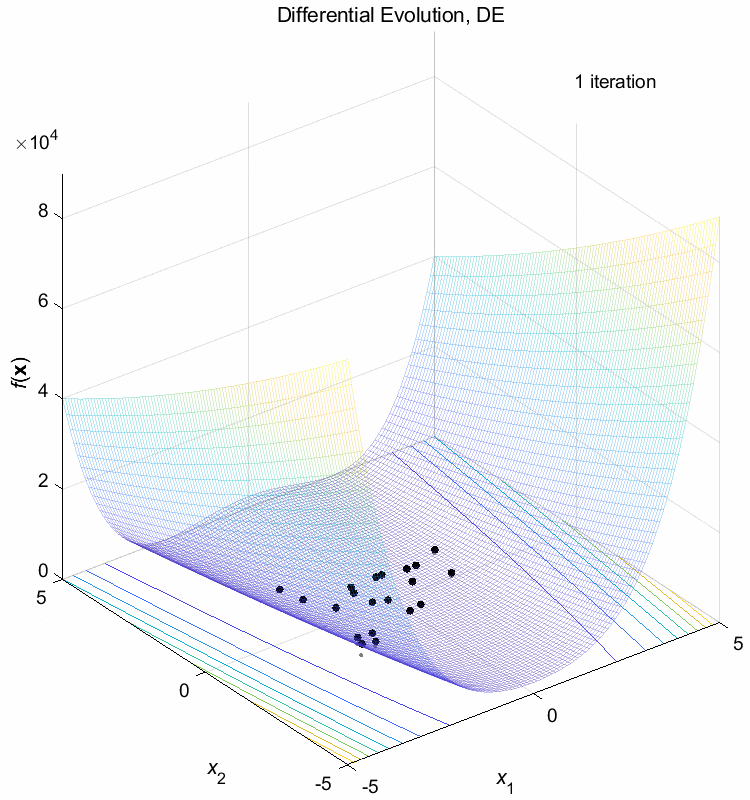</a><a href="animation/RosenbrockPSO.gif">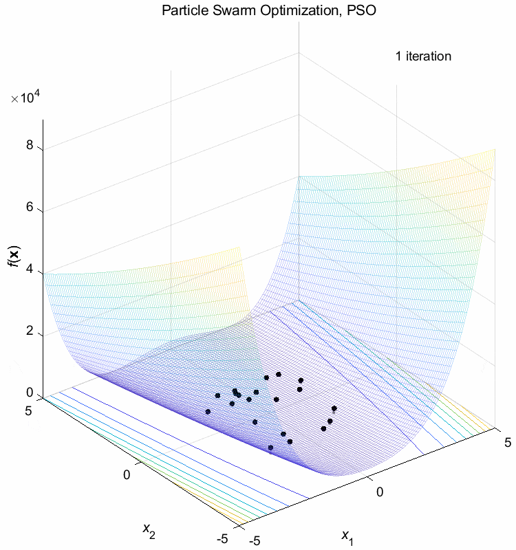</a><a href="animation/RosenbrockAS.gif">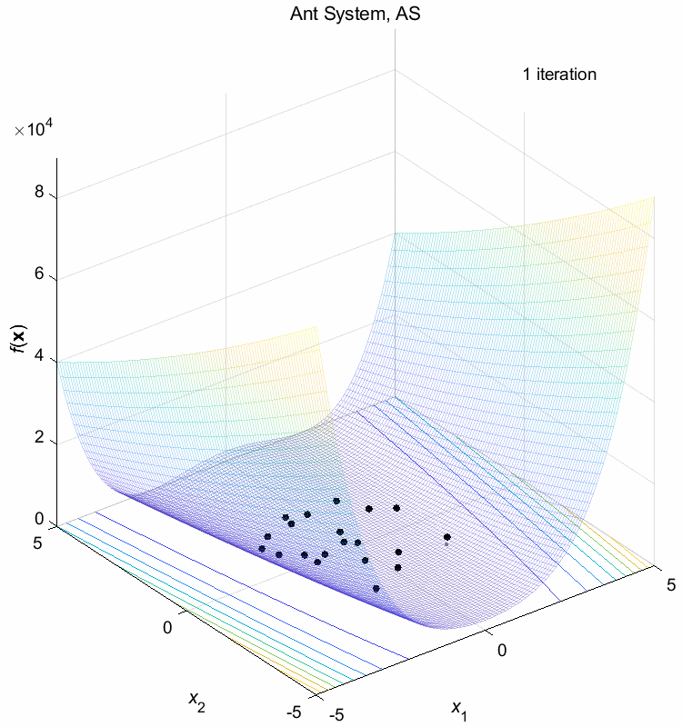</a>

### Sphere function:
$$ \text{Minimize } f(\boldsymbol{x}) = \sum_{i=1}^n x_i^2$$  
$$-5 \leq x_i \leq 5$$&nbsp;&nbsp;&nbsp;&nbsp;&nbsp;&nbsp;$$f^*(\boldsymbol{x}) = (0,0,\dots,0)=0 $$

&nbsp;&nbsp;Genetic Algorithm, GA&nbsp;&nbsp;&nbsp;&nbsp;&nbsp;&nbsp;Evolutionary Programming, EP&nbsp;&nbsp;&nbsp;&nbsp;&nbsp;&nbsp;EDA-PBIL
<a href="animation/SphereGA.gif">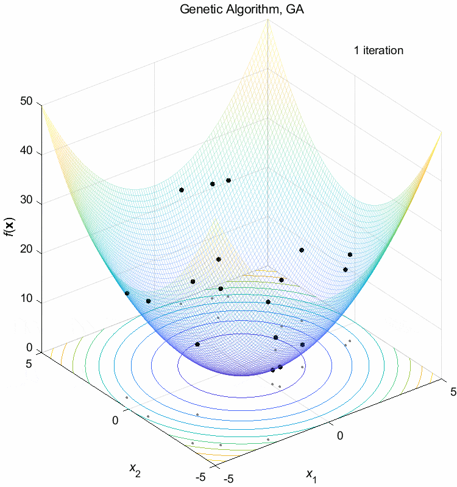</a><a href="animation/SphereEP.gif">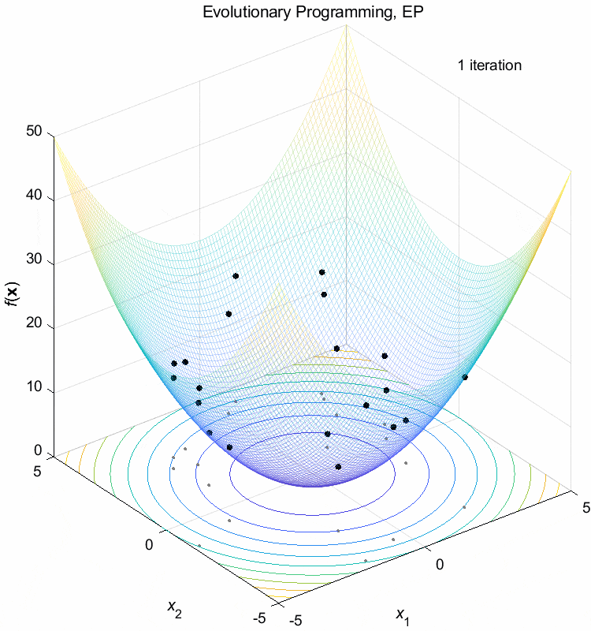</a><a href="animation/SpherePBIL.gif">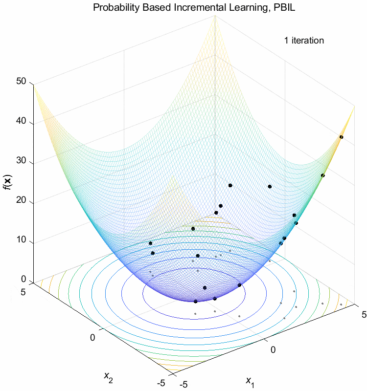</a>

&nbsp;&nbsp;Differential Evolution, DE&nbsp;&nbsp;&nbsp;&nbsp;&nbsp;&nbsp;Particle Swarm Optimization, PSO&nbsp;&nbsp;&nbsp;&nbsp;&nbsp;&nbsp;Ant System, AS  
<a href="animation/SphereDE.gif">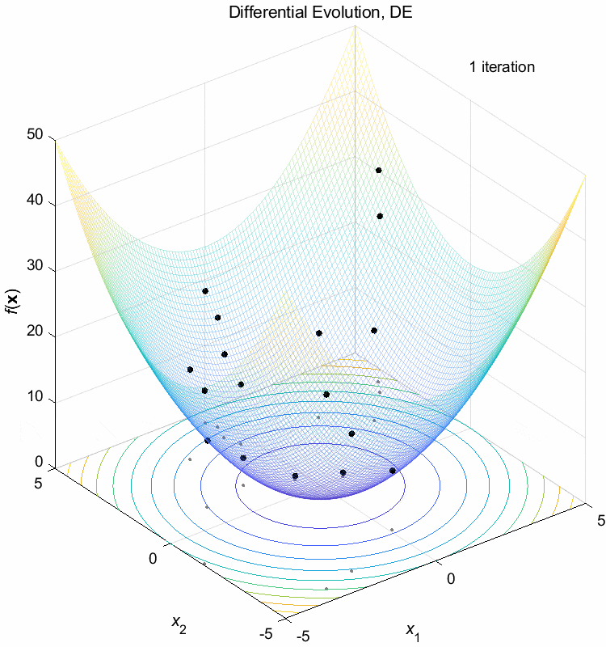</a><a href="animation/SpherePSO.gif">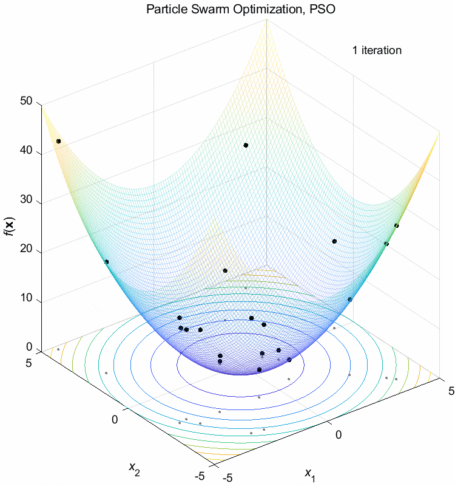</a><a href="animation/SphereAS.gif">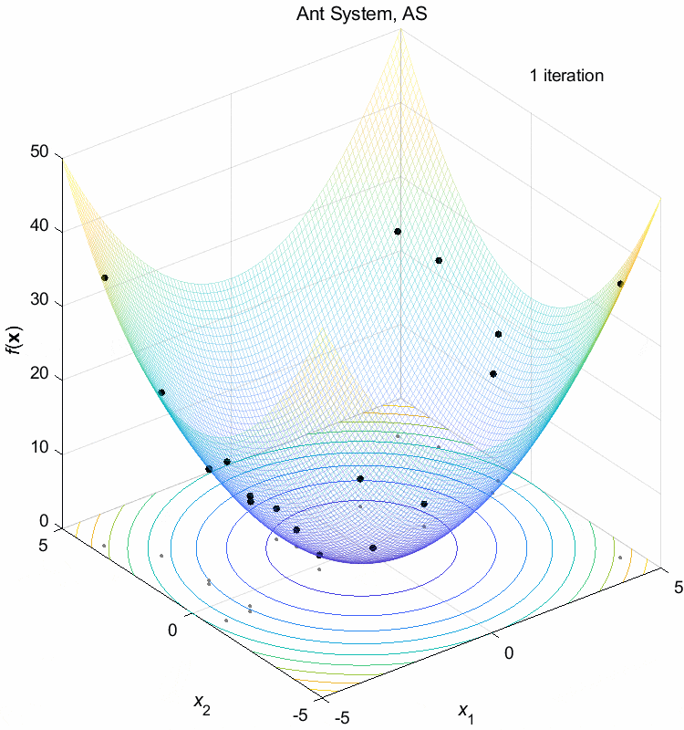</a>

## Javascript Animation
### Weight Vector Generation Method
You can change the weight vector size in the animation
* [Simplex-lattice design](animation/SLD.html){:target="_blank"}
* [Incremental lattice design](animation/ILD.html){:target="_blank"}
* [Riesz 𝑠-energy](animation/Energy.html){:target="_blank"}
* Hammersley method

### Weight Vector Change Method
You can change the weight vector distribution in the animation
* [Change method 1](animation/Change1.html){:target="_blank"}
* [Change method 2](animation/Change2.html){:target="_blank"}
* [Change method 3](animation/Change3.html){:target="_blank"}
* [Change method 4](animation/Change4.html){:target="_blank"}
* Normalized change method 1 (This distribution does not change)
* [Normalized change method 2](animation/NChange2.html){:target="_blank"}
* [Normalized change method 3](animation/NChange3.html){:target="_blank"}
* [Normalized change method 4](animation/NChange4.html){:target="_blank"}

## Reference 
Dan Simon, Evolutionary Optimization Algorithms: Biologically-Inspired and Population-Based Approaches to Computer Intelligence, John Wiley & Sons, 2013.
[https://academic.csuohio.edu/simond/EvolutionaryOptimization](https://academic.csuohio.edu/simond/EvolutionaryOptimization)  