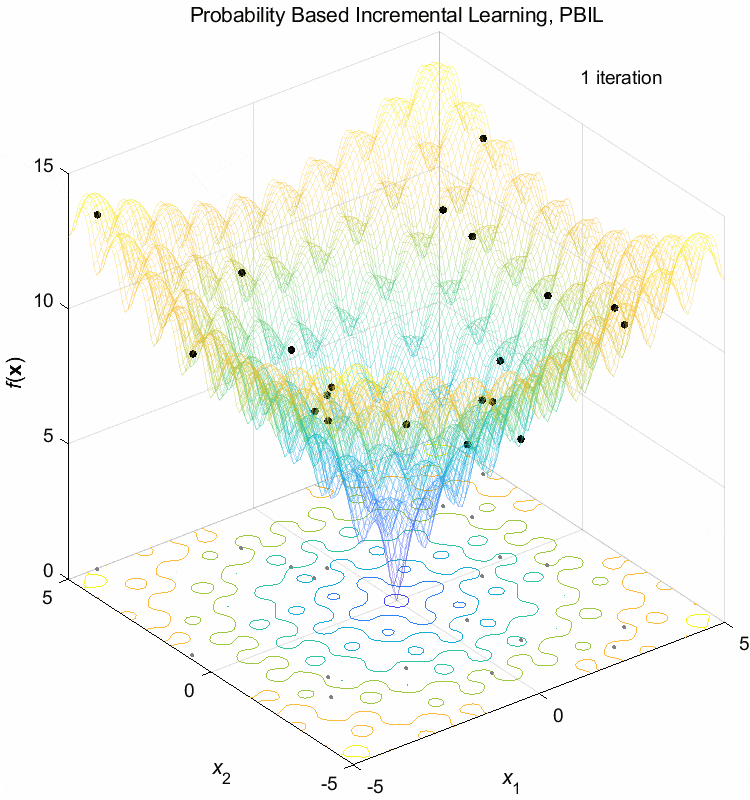

## GIF Animation
### Ackley function:
$$ \text{Minimize } f(\boldsymbol{x}) = -20 \exp(-0.2 \sqrt{\frac{1}{n} \sum_{i=1}^n x_i^2}) - \exp(\frac{1}{n} \sum_{i=1}^n \cos(2\pi x_i)) + 20 + \exp(1)$$  
$$(-5 \leq x_i \leq 5)$$  
Genetic Algorithm, GA&nbsp;&nbsp;&nbsp;&nbsp;&nbsp;&nbsp;&nbsp;&nbsp;Evolutionary Programming,EP&nbsp;&nbsp;&nbsp;&nbsp;&nbsp;&nbsp;&nbsp;&nbsp;EDA-PBIL

Differential Evolution, DE&nbsp;&nbsp;&nbsp;&nbsp;&nbsp;&nbsp;&nbsp;&nbsp;Particle Swarm Optimization, PSO&nbsp;&nbsp;&nbsp;&nbsp;&nbsp;&nbsp;&nbsp;&nbsp;Ant System, AS  

## Javascript Animation
### Weight Vector Generation Method
You can change the weight vector size in the animation
* [Simplex-lattice design](animation/SLD.html){:target="_blank"}
* [Incremental lattice design](animation/ILD.html){:target="_blank"}
* [Riesz 𝑠-energy](animation/Energy.html){:target="_blank"}
* Hammersley method

### Weight Vector Change Method
You can change the weight vector distribution in the animation
* [Change method 1](animation/Change1.html){:target="_blank"}
* [Change method 2](animation/Change2.html){:target="_blank"}
* [Change method 3](animation/Change3.html){:target="_blank"}
* [Change method 4](animation/Change4.html){:target="_blank"}
* Normalized change method 1 (This distribution does not change)
* [Normalized change method 2](animation/NChange2.html){:target="_blank"}
* [Normalized change method 3](animation/NChange3.html){:target="_blank"}
* [Normalized change method 4](animation/NChange4.html){:target="_blank"}

## Reference 
Dan Simon, Evolutionary Optimization Algorithms: Biologically-Inspired and Population-Based Approaches to Computer Intelligence, John Wiley & Sons, 2013.
[https://academic.csuohio.edu/simond/EvolutionaryOptimization](https://academic.csuohio.edu/simond/EvolutionaryOptimization)  