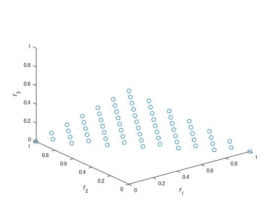
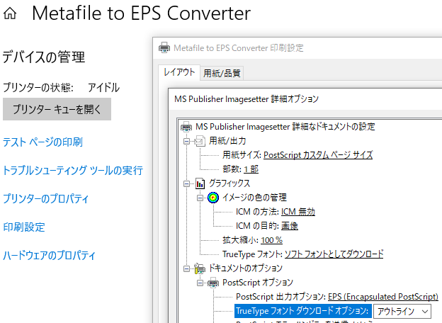
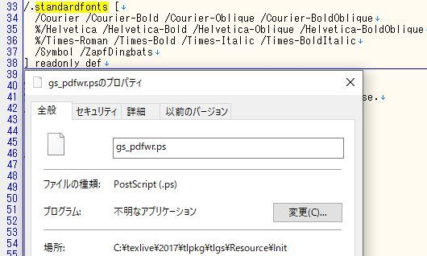
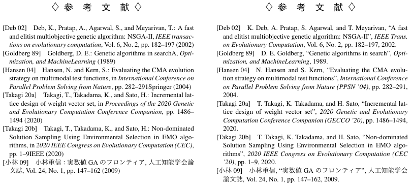

[学会カレンダー](#学会カレンダー)  
[略歴とShort Biography](#略歴とshort-biography)  
[ブログ](#ブログ)  
[その他の経歴](#その他の経歴)  
[PCにインストールしているもの](#pcにインストールしているもの)  
[進化計算学会の簡易まとめ](#進化計算学会の簡易まとめ)  
[Matlabで図を作成する関数](#matlabで図を作成する関数)  
[Springer LNCSスタイルファイルのダウンロード方法](#springer-lncsスタイルファイルのダウンロード方法)  
[IEEEなどの投稿規定を満たすPDF作成方法](#ieeeなどの投稿規定を満たすpdf作成方法)  
[参考文献スタイルファイル (.bst)変更メモ](#参考文献スタイルファイル-bst変更メモ)  

### 学会カレンダー

<strong>2022年</strong>

3月17(木)-18(金)：<a href="http://www.jpnsec.org/symposium202201.html" target="_blank">第21回進化計算学会研究会</a>

会場：日本, オンライン　申込〆切：2/18(金)　原稿〆切：3/4(金)　採択通知：

4月20(水)-22(金)：<a href="http://www.evostar.org/2022" target="_blank">EvoStar</a>

会場：Seville, Spain　申込〆切：　　原稿〆切：11/24(水)　採択通知：1/26(水)

6月26(土)-7月1(水)：<a href="https://mcdm2021.org" target="_blank">MCDM</a>

会場：Portsmouth, UK　申込〆切：　　原稿〆切：3/1(木)　採択通知：4/30(金)

7月9(土)-13(水)：<a href="https://gecco-2022.sigevo.org" target="_blank">GECCO</a>

会場：Boston, USA　申込〆切：1/27(木)　原稿〆切：2/3(木)　採択通知：3/25(金)

7月18(月)-23(土)：<a href="https://wcci2022.org" target="_blank">IEEE WCCI</a>

会場：Padua, Italy　申込〆切：　　原稿〆切：1/31(月)　採択通知：4/26(火)

2022年8月21(日)-24(水)：<a href="https://ieee-cog.org/2022" target="_blank">IEEE CoG</a>

会場：Beijing, China　申込〆切：　　原稿〆切：3/1(火)　採択通知：4/30(土)

9月7(水)-8(木)：<a href="http://www.jpnsec.org/symposium202202.html" target="_blank">第22回進化計算学会研究会</a>

会場：日本, 東京　申込〆切：8/11(木)　原稿〆切：8/25(木)　採択通知：

9月9(金)-11(日)：<a href="https://www.icmlc.com/" target="_blank">IEEE ICMLC</a>

会場：日本, 富山　申込〆切：　　原稿〆切：6/1(水)　採択通知：8/1(月)

9月10(土)-14(水)：<a href="https://ppsn2022.cs.tu-dortmund.de" target="_blank">PPSN</a>

会場：Dortmund, Germany　申込〆切：　　原稿〆切：4/13(水)　採択通知：

2022年9月21(水)-22(木)：<a href="https://sites.google.com/view/fan2022" target="_blank">FAN</a>

会場：日本, 神戸　申込〆切：6/15(水)　原稿〆切：7/15(水)　採択通知：

11月25(金)-27(日)：<a href="https://ssi2022.sice.or.jp" target="_blank">SSI</a>

会場：日本, 大阪　申込〆切：　　原稿〆切：　　採択通知：

11月29(火)-12月2(金)：<a href="http://scis.j-soft.org/2022" target="_blank">SCIS&ISIS</a>

会場：日本, 伊勢志摩　申込〆切：　　原稿〆切：6/24(金)　採択通知：8/19(木)

12月4(日)-7(水)：<a href="https://www.ieeessci2022.org" target="_blank">IEEE SSCI</a>

会場：Singapore　申込〆切：　　原稿〆切：7/1(金)　採択通知：9/1(木)

12月17(土)-18(日)：<a href="http://www.jpnsec.org/symposium202203.html" target="_blank">進化計算シンポジウム2022</a>

会場：日本, 札幌　申込〆切：11/11(金)　原稿〆切：11/27(金)　採択通知：

2023年3月2(木)-4(土)：<a href="https://www.ipsj.or.jp/event/taikai/85/index.html" target="_blank">情報処理学会 第85回全国大会</a>

会場：日本, 東京　申込〆切：12/12(月)　原稿〆切：1/13(金)　採択通知：

2023年3月6(月)-7(火)：<a href="http://www.jpnsec.org/symposium202301.html" target="_blank">第23回進化計算学会研究会</a>

会場：日本, 東京　申込〆切：2/10(金)　原稿〆切：2/24(金)　採択通知：

2023年3月20(月)-24(金)：<a href="https://emo2023.liacs.leidenuniv.nl" target="_blank">EMO</a>

会場：Leiden, Netherlands　申込〆切：　　原稿〆切：10/27(木)　採択通知：12/2(金)　

2023年7月1(土)-5(水)：<a href="https://2023.ieee-cec.org" target="_blank">IEEE CEC</a>

会場：Chicago, USA　申込〆切：　　原稿〆切：　　　　採択通知：

2023年7月15(土)-19(水)：<a href="https://gecco-2023.sigevo.org" target="_blank">GECCO</a>

会場：Lisbon, Portugal　申込〆切：　　原稿〆切：　　　　採択通知：

2023年9月12(火)-13(水)：<a href="http://www.jpnsec.org/symposium202302.html" target="_blank">第24回進化計算学会研究会</a>

会場：日本, 京都　申込〆切：　　原稿〆切：　　採択通知：

2023年10月1(日)-4(水)：<a href="https://ieeesmc2023.org" target="_blank">IEEE SMC</a>

会場：Hawaii, USA　申込〆切：　　原稿〆切：4/23(日)　採択通知：5/27(土)　

2023年12月5(火)-8(金)：<a href="https://attend.ieee.org/ssci-2023" target="_blank">IEEE SSCI</a>

会場：Mexico City, Mexico　申込〆切：　　原稿〆切：7/1(土)　採択通知：9/1(金)　

2023年12月22(金)-23(土)：<a href="http://www.jpnsec.org/symposium202303.html" target="_blank">進化計算シンポジウム2023</a>

会場：日本, 神奈川　申込〆切：　　原稿〆切：　　採択通知：

2024年7月2(日)-5(水)：<a href="https://wcci2024.org" target="_blank">IEEE WCCI</a>

会場：日本, 横浜　申込〆切：　　原稿〆切：1/15(月)　採択通知：3/15(金)

### 略歴とShort Biography
2018年電気通信大学情報理工学部総合情報学科卒業．2020年同大学大学院情報理工学研究科情報学専攻博士前期課程修了．2023年同専攻博士後期課程修了．博士（工学）．2023年より電気通信大学客員研究員．進化計算，多目的最適化，これらの応用に関する研究に従事．2020年IEEE CIS日本支部Young Researcher Award，進化計算コンペティション2020単目的部門と多目的部門のトップ賞，2022年度進化計算学会論文誌論文賞などを受賞．IEEE，進化計算学会，各会員．

Tomoaki Takagi received the B.E., M.E., and Ph.D. degrees from The University of Electro-Communications, Japan, in 2018, 2020, and 2023, respectively. He is currently a Visiting Researcher at The University of Electro-Communications. His research interests include evolutionary multi- and many-objective optimization and its applications. He is also a member of IEEE and the Japanese Society for Evolutionary Computation. He received IEEE CIS Japan Chapter Young Researcher Award in 2020, the Evolutionary Computation Competition First Award for Single-Objective and Multi-Objective Track in 2020, and the Transaction of the Japanese Society for Evolutionary Computation Beat Paper Award in 2022.

### [ブログ](https://www.timedia.co.jp/author/tomtkg)
- [中身が2行だけ書かれたプログラムを全力解説（前編）](https://www.timedia.co.jp/tech/20220414-tech)
- [中身が2行だけ書かれたプログラムを全力解説（中編）](https://www.timedia.co.jp/tech/20220427-tech)
- [中身が2行だけ書かれたプログラムを全力解説（後編）](https://www.timedia.co.jp/tech/20220517-tech)
- [散布図と9つの図](https://www.timedia.co.jp/tech/20220524-tech)
- [Excelで進化計算(1)](https://www.timedia.co.jp/tech/20220606-tech)
- [Excelで進化計算(2)](https://www.timedia.co.jp/tech/20220608-tech)
- [Excelで進化計算(3)](https://www.timedia.co.jp/tech/20220623-tech)
- [Excelで進化計算(4)](https://www.timedia.co.jp/tech/20230112-tech)
- [Latin hypercube sampling(LHS) を調査](https://www.timedia.co.jp/tech/20220714-tech)
- [WCCI2022(1) 事前準備レポート](https://www.timedia.co.jp/tech/20220816-tech)
- [WCCI2022(2) 招待講演レポート](https://www.timedia.co.jp/tech/20220823-tech)
- [WCCI2022(3) 口頭発表レポート](https://www.timedia.co.jp/tech/20220825-tech)
- [WCCI2022(4) 現地参加レポート](https://www.timedia.co.jp/tech/20220830-tech)
- [EvoTorch触ってみた](https://www.timedia.co.jp/tech/20221101-tech)
- [Issueを初投稿した話](https://www.timedia.co.jp/tech/20221124-tech)
- [LaTeXで印刷に適した文書を作成する](https://www.timedia.co.jp/tech/20221201-tech)
- [LaTeXの便利なパッケージ](https://www.timedia.co.jp/tech/20221208-tech)
- [SSI2022 参加報告](https://www.timedia.co.jp/tech/20221215-tech)
- [進化計算シンポジウム2022 参加報告](https://www.timedia.co.jp/tech/20230126-tech)
- [進化計算学会 論文誌 論文賞を振り返る](https://www.timedia.co.jp/tech/20230131-tech)
- [書評：『最適化アルゴリズム』](https://www.timedia.co.jp/tech/20230302-tech)
- [IEEE Access に論文が採択・公開されました](https://www.timedia.co.jp/tech/20230316-tech)
- [情報処理学会 第85回全国大会 参加報告](https://www.timedia.co.jp/tech/20230327-tech)
- [第23回 進化計算学会 研究会 参加報告](https://www.timedia.co.jp/tech/20230413-tech)
- [EMO2023 参加報告 前編](https://www.timedia.co.jp/tech/202305011-tech)
- [EMO2023 参加報告 後編](https://www.timedia.co.jp/tech/20230518-tech)
- [gitでコミットの順序を入れ替える 2023](https://www.timedia.co.jp/tech/20230530-tech)
- [Go言語プログラムの資料を自動生成する](https://www.timedia.co.jp/tech/20230606-tech)

### その他の経歴
**指導経験**
- 平成31年度 ティーチングアシスタント（プログラミング通論および演習）.
- Teaching Assistant, Topics in Informatics I: Evolutionary Computation（国際科目）, 2019.

**講演・発表（論文なし）**
- Tomoaki Takagi: **Pareto Front Estimation for Subset Selection**, Workshop on Subset Selection in Evolutionary Multi-objective Optimization at 2022 IEEE World Congress on Computational Intelligence (WCCI2022), 2022. [Link](https://cse.sustech.edu.cn/faculty/~shangk/SS-WCCI/){:target="_blank"}.
- 高木智章: **MATLABによる点群データの可視化**, MATLAB EXPO 2023 JAPAN, 2023.

**運営**
- 運営スタッフ, 情報処理学会 第126回数理モデル化と問題解決(MPS)研究会, 2019.
- オーガナイザー, スペシャルセッション「進化計算の新世代」, 計測自動制御学会 システム・情報部門 学術講演会 SSI2022, 2022.

**資格**
- 2014年11月: 実用英語技能検定2級
- 2015年 3月: ITパスポート
- 2015年 9月: 普通自動車第一種運転免許
- 2015年11月: 基本情報技術者
- 2023年 5月: AWS認定Cloud Practitioner

### PCにインストールしているもの
- ウェブブラウザ：Edge, Chrome.
- エディタ：sakura-editor, VS Code.
- コミュニケーション：Slack, Zoom.
- ファイル共有：Dropbox, Google drive.
- プログラミング：MATLAB, Python, GO.
- 論文作成：Grammarly, Ghostscript, GSview.
- EPS：Metafile to EPS Converter.
- Git：Git Bash, GitHub Desktop.
- PDF：pdf_as, Sumatra PDF.
- Tex：TexStudio, TeXWorks.
- Unix：Docker, GnuWin32, WSL2.
- その他：7-Zip, OpenVPN, MPC-HC, Office365, WinMerge.

### 進化計算学会の簡易まとめ
進化計算学会論文誌に掲載されている論文を表形式でまとめた． [表: 進化計算学会論文誌の論文](data/tjpnsec){:target="_blank"}  
著者は4人まで載せている．著者が5人以上の論文も一部あるため，参考文献を書くときは注意されたい．

進化計算学会が主催している会議の論文を表形式でまとめた．  [表: 進化計算学会主催会議の論文](data/jpnsec){:target="_blank"}  
著者は4人まで載せている．著者が5人以上の論文も一部あるため，参考文献を書くときは注意されたい．  
ページ数の情報が一部欠落している．また，論文の中身は非公開となっている．

### Matlabで図を作成する関数
自分がMatlabで3次元の図を作成するときに使っている関数．  
区間[0-1]に正規化された3次元の点群dataとその名前nameを入力する．


function SaveImage(data,name)
    figure('Position',[100 100 500 500],'Visible','on');
    set(gca,'Fontname','Times New Roman','FontSize',13,'NextPlot','add', ...
        'Color','none','Box','on','View',[135 30],'LooseInset', get(gca, 'TightInset'));
    plot3(data(:,1),data(:,2),data(:,3),'o','MarkerSize',8, ...
        'Markerfacecolor',[.7 .7 .7],'Markeredgecolor',[.4 .4 .4]);
    xlim([-0.05 1.05]); xlabel('\it f\rm_1','position',[0.4,1.2,-0.15]);
    ylim([-0.05 1.05]); ylabel('\it f\rm_2','position',[1.2,0.4,-0.15]);
    zlim([-0.05 1.05]); zlabel('\it f\rm_3','position',[0.4,-0.77,0.5],'Rotation',0);
    zticks([0 0.5 1]); axis square;
    exportgraphics(gcf,[name,'.pdf'],'BackgroundColor','none','ContentType','vector');
    exportgraphics(gcf,[name,'.emf'],'BackgroundColor','none','ContentType','vector');
    savefig([name,'.fig']); close;
end


図は正方形で余白は極めて小さい．11行目にブレークポイントを設定して，目視で確認することが多い．  
画像はベクタ形式の透過背景で保存．論文にはpdf，パワーポイントにはemfで出力した画像を用いる．  
左は自分の設定で生成されるベクタ画像．右はmatlabの基本設定で生成されるラスタ画像．

<embed src="image/image.pdf#toolbar=0&navpanes=0&scrollbar=0&view=FitB" type="application/pdf" width="300" height="315">

### Springer LNCSスタイルファイルのダウンロード方法
~~まず最初に，2021年3月10日時点でのSpringer LNCSスタイルファイルのURLを示す．ftp://ftp.springernature.com/cs-proceeding/llncs/llncs2e.zip　Springer LNCSのURLは，http，httpsではなくftpから始まっている．Google Chrome，Microsoft Edgeなどはftpへの対応を止めたため，通常の設定ではファイルのダウンロードが不可能となっている．ファイルをダウンロードする一番簡単な解決策はInternet Explorerで上記URLを開くことである．ただし，安全に利用できないとして他のウェブブラウザでは利用を非推奨・不可能にしているものを，開発が終了した古いウェブブラウザを使って安全でない状態で利用する点に注意されたい．他の手段，スタンドアロンのFTPソフトウエアを利用する方法でもダウンロードができる．Springerがftpを利用しないファイル提供方法を用意することを期待したい．~~  
[こちら](https://www.springer.com/gp/computer-science/lncs/conference-proceedings-guidelines)から，ダウンロードできるようになりました．ftpは，使えなくなりました．  
古いテンプレートは捨てて，新しい「LaTeX2e Proceedings Templates」を使うのが良いと思います．

### IEEEなどの投稿規定を満たすPDF作成方法
IEEEなどに投稿する最終論文は，学会が用意した機械的なチェックをクリアしないと投稿できない．  
採択の通知から最終投稿までの期間が短く，論文チェック可能な回数も制限があるので注意が必要.  
ローカルで論文チェックする方法と修正方法：
- texのコンパイルはplatexではなく，pdflatexを使う
- pdffontsコマンドで使われているフォント情報を確認
    - pdffonts hoge.pdfで全体確認
    - pdffonts -f 4 -l 6 hoge.pdf で4～6ページだけ確認
- Syntax ErrorかType3が表示されたらアウト
- 基本的にeps画像が悪いと考えてよい
- パワーポイントの画像をepsにするならMetafile to EPS Converterを使う．かつ詳細オプションのTrueTypeフォントとダウンロードオプションを画像のように変更
- texlive使っているならgs_pdfwr.ps 33行目 standardfonts内の項目をコメントアウトする

### 参考文献スタイルファイル (.bst)変更メモ
文献リストファイル (.bib)の中身はGoogle ScholarのBibTexを参考にする  
jpnsec.bstで変更した部分
- Line 84,85: ": " -> ", "
- Line 245: "{ll,\~~}{vv~}{f.}{, jj}" -> "{f.~~}{ll}{vv~}{, jj}"
- Line 302: 'title -> {title  "``" swap$ * "''" * }
- Line 336: {" (" year * ")" * } -> {", " year * "." * }
- Line 525,530,573,580,630,677,682,687: "in" -> ""
- Line 837,846: organization output -> 
- Line 1036: -> MACRO {tec}  {"IEEE Trans. on Evolutionary Computation"}

後はbib, bblを自由に変更する (journal, booktitleなど)

左：変更前，右：変更後

