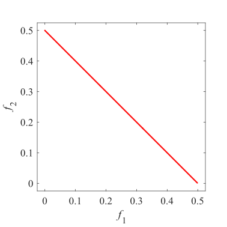
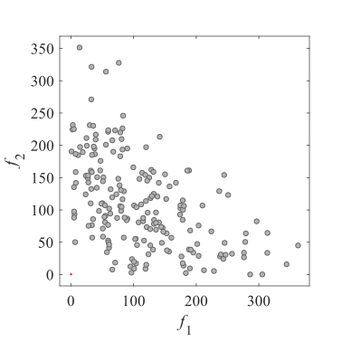
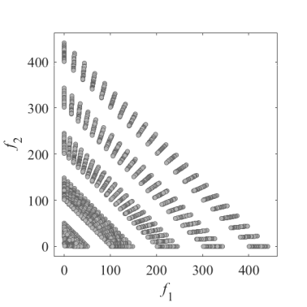
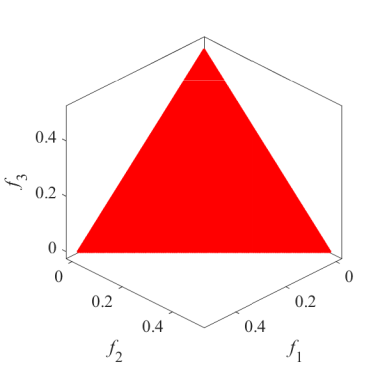
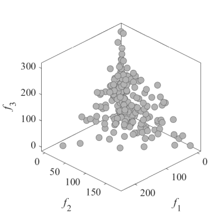
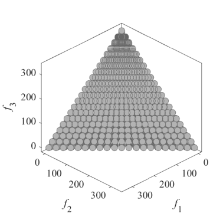

## 最適化の基礎講義 / Basic lecture on optimization
### Question
* [question1](lecture/question1.html){:target="_blank"}
* [question2](lecture/question2.html){:target="_blank"}
* [question3](lecture/question3.html){:target="_blank"}
* [question4](lecture/question4.html){:target="_blank"}

### Evaluator (using query string) & Solver (written in python)
* [evaluator1](lecture/evaluator1.html?input=1){:target="_blank"} (input=1)
* [solver1](lecture/solver1.txt){:target="_blank"} ([solver1.py](lecture/solver1.py){:target="_blank"})
* [evaluator2](lecture/evaluator2.html?input=001){:target="_blank"} (input=001)
* [solver2](lecture/solver2.txt){:target="_blank"} ([solver2.py](lecture/solver2.py){:target="_blank"})
* [evaluator3](lecture/evaluator3.html?latitude=035.682500&longitude=139.752778){:target="_blank"} (latitude=035.682500&longitude=139.752778)
* solver3 (solver3.py)
* [evaluator4](lecture/evaluator4.html?latitude=035.682500&longitude=139.752778&year=01&month=01){:target="_blank"} (latitude=035.682500&longitude=139.752778&year=01&month=01)
* solver4 (solver4.py)

### Answer
* [answer1](lecture/answer1.html){:target="_blank"}
* [answer2](lecture/answer2.html){:target="_blank"}
* [answer3](lecture/answer3.html){:target="_blank"}
* [answer4](lecture/answer4.html){:target="_blank"}

&nbsp;

## Image of multi-objective optimization test problems
**Left image is Pareto front**  
**Center image is Pareto front and random points**  
Point size _N_ = 200. Number of variables _D_ = 5 (if possible).
**Right image is Pareto front and grid points**  
Point size _N_ = 21^5. Number of variables _D_ = 5 (if possible).

Red points are Parto optimal solution.  
Blue points are infeasible solution.  
Grey points are feasible solution.  

### Examples (DTLZ1)
  
  

### List of problems
* [BT(Benchmark MOP with bias feature)](https://github.com/tomtkg/Test_Functions_for_Multi-objective_Optimization/blob/master/Problems/BT/README.md)  
* [CF(Constrained benchmark MOP)](https://github.com/tomtkg/Test_Functions_for_Multi-objective_Optimization/blob/master/Problems/CF/README.md)  
* [Combinatorial MOPs](https://github.com/tomtkg/Test_Functions_for_Multi-objective_Optimization/blob/master/Problems/Combinatorial%20MOPs/README.md)  
* [DASCMOP(Difficulty-adjustable and scalable constrained benchmark MOP)](https://github.com/tomtkg/Test_Functions_for_Multi-objective_Optimization/blob/master/Problems/DASCMOP/README.md)  
* [Distance minimization problems](https://github.com/tomtkg/Test_Functions_for_Multi-objective_Optimization/blob/master/Problems/Distance%20minimization%20problems/README.md)  
* [DOC(Benchmark MOP with constraints in both decision and objective spaces)](https://github.com/tomtkg/Test_Functions_for_Multi-objective_Optimization/blob/master/Problems/DOC/README.md)  
* [DTLZ(Benchmark MOP proposed by Deb, Thiele, Laumanns, and Zitzler)](https://github.com/tomtkg/Test_Functions_for_Multi-objective_Optimization/blob/master/Problems/DTLZ/README.md)  
* [IMOP(Benchmark MOP with irregular Pareto front)](https://github.com/tomtkg/Test_Functions_for_Multi-objective_Optimization/blob/master/Problems/IMOP/README.md)  
* [LIRCMOP(Constrained benchmark MOP with large infeasible regions)](https://github.com/tomtkg/Test_Functions_for_Multi-objective_Optimization/blob/master/Problems/LIRCMOP/README.md)  
* [LSMOP(Large-scale benchmark MOP)](https://github.com/tomtkg/Test_Functions_for_Multi-objective_Optimization/blob/master/Problems/LSMOP/README.md)  
* [MaF(Modified 15 test problems for many-objective optimization)](https://github.com/tomtkg/Test_Functions_for_Multi-objective_Optimization/blob/master/Problems/MaF/README.md)  
* [Benchmark MOP for Inverse Modeling - MOEA](https://github.com/tomtkg/Test_Functions_for_Multi-objective_Optimization/blob/master/Problems/MOPs%20in%20IM-MOEA/README.md)  
* [Benchmark MOP for MOEA/D-DE](https://github.com/tomtkg/Test_Functions_for_Multi-objective_Optimization/blob/master/Problems/MOPs%20in%20MOEA-D-DE/README.md)  
* [Benchmark MOP for MOEA/D-M2M](https://github.com/tomtkg/Test_Functions_for_Multi-objective_Optimization/blob/master/Problems/MOPs%20in%20MOEA-D-M2M/README.md)  
* [Benchmark MOP for Regularity Model-based - MEDA](https://github.com/tomtkg/Test_Functions_for_Multi-objective_Optimization/blob/master/Problems/MOPs%20in%20RM-MEDA/README.md)  
* [MW(Constrained benchmark MOP proposed by Ma and Wang)](https://github.com/tomtkg/Test_Functions_for_Multi-objective_Optimization/blob/master/Problems/MW/README.md)  
* [SMOP(Benchmark MOP with sparse Pareto optimal solutions)](https://github.com/tomtkg/Test_Functions_for_Multi-objective_Optimization/blob/master/Problems/Sparse%20MOPs/README.md)  
* [TREE(The time-varying ratio error estimation problems)](https://github.com/tomtkg/Test_Functions_for_Multi-objective_Optimization/blob/master/Problems/TREE/README.md)  
* [UF(Unconstrained benchmark MOP)](https://github.com/tomtkg/Test_Functions_for_Multi-objective_Optimization/blob/master/Problems/UF/README.md)  
* [VNT(Benchmark MOP proposed by Viennet)](https://github.com/tomtkg/Test_Functions_for_Multi-objective_Optimization/blob/master/Problems/VNT/README.md)  
* [WFG(Benchmark MOP proposed by Walking Fish Group)](https://github.com/tomtkg/Test_Functions_for_Multi-objective_Optimization/blob/master/Problems/WFG/README.md)  
* [ZDT(Benchmark MOP proposed by Zitzler, Deb, and Thiele)](https://github.com/tomtkg/Test_Functions_for_Multi-objective_Optimization/blob/master/Problems/ZDT/README.md)  

### Reference  
Y. Tian, R. Cheng, X. Zhang, and Y. Jin, PlatEMO: A MATLAB platform
for evolutionary multi-objective optimization [educational forum], IEEE
Computational Intelligence Magazine, 2017, 12(4): 73-87.  

I use [PlatEMO](https://github.com/BIMK/PlatEMO/){:target="_blank"}. Some Problems directory files and Public directory files are same as old version of PlatEMO.  
I hope visitors can help their visual understanding of multi-objective optimization problem.
