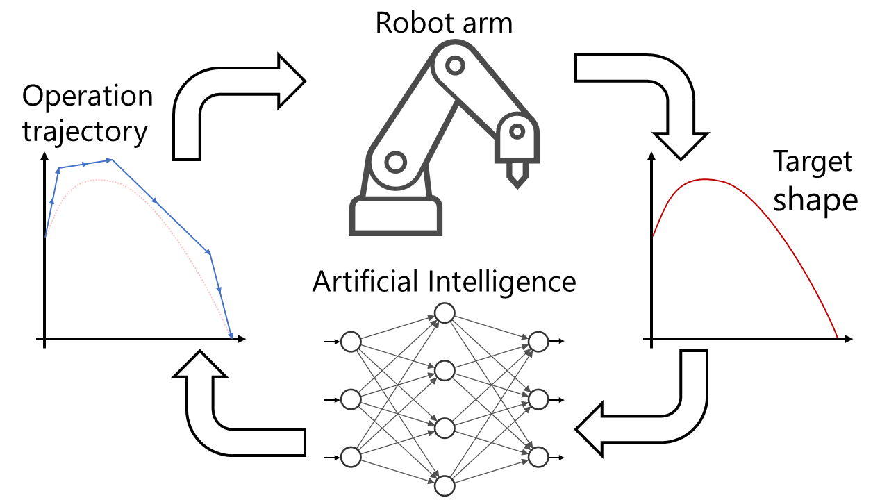
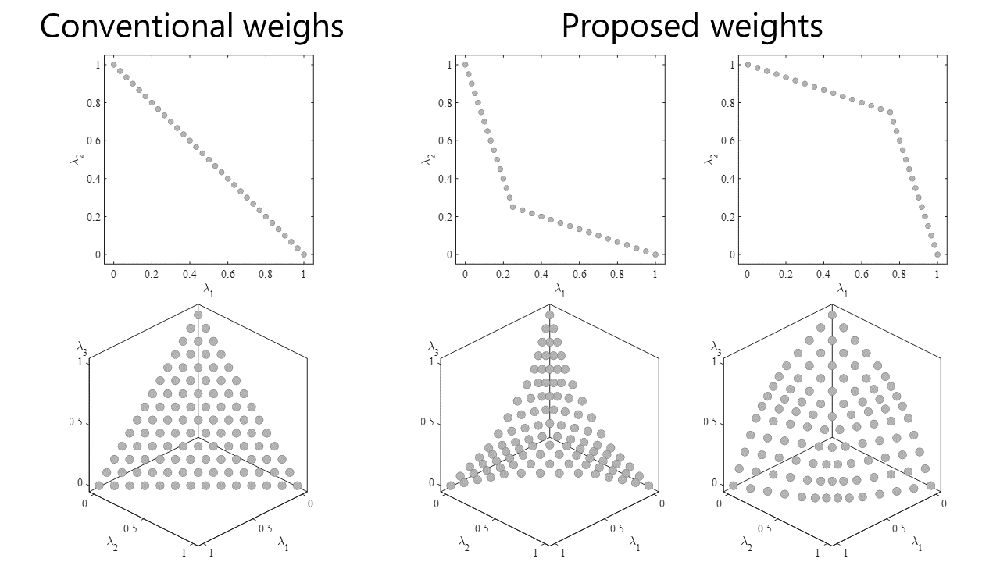
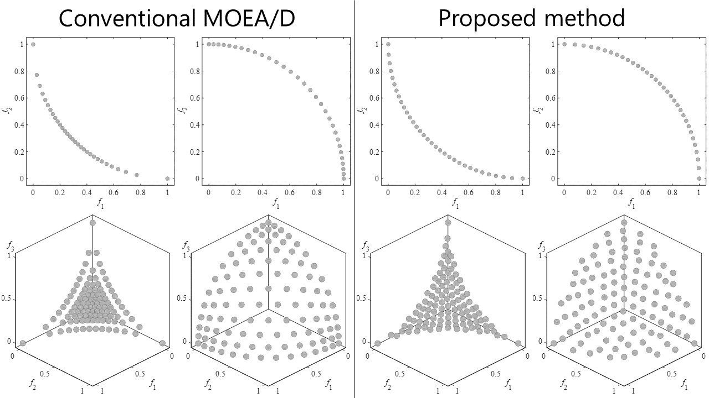
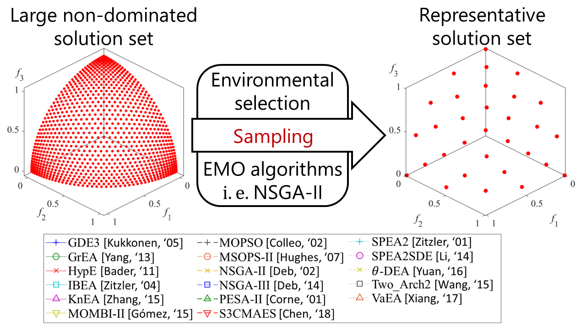
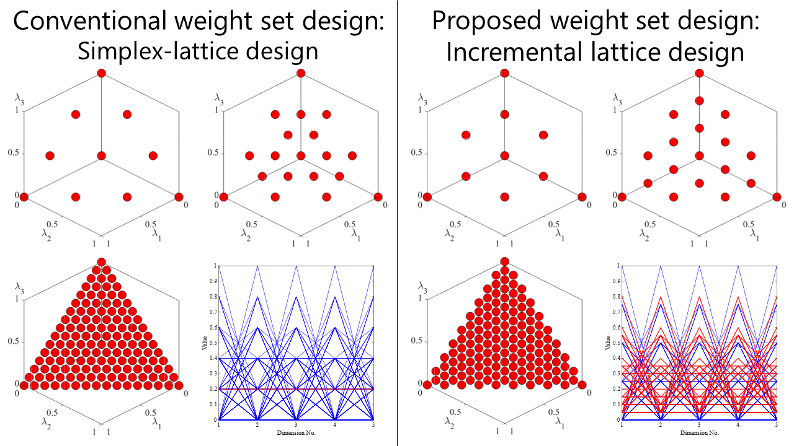
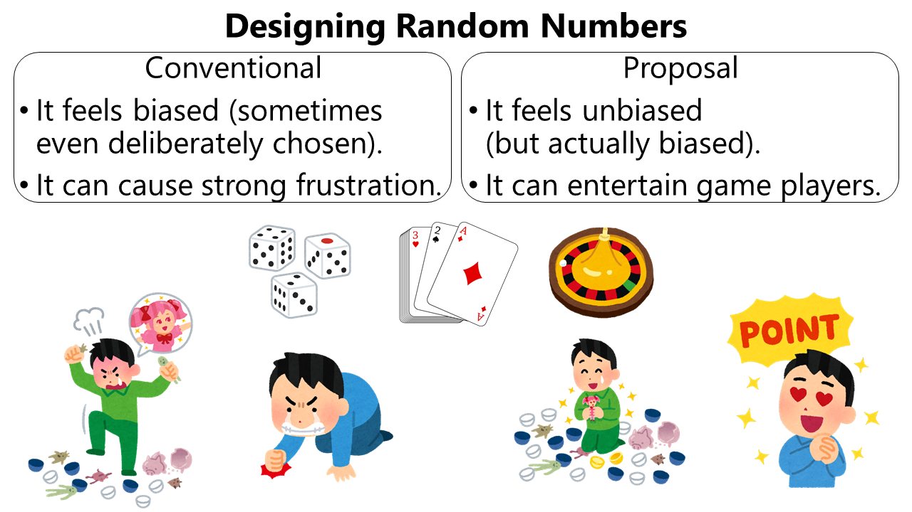
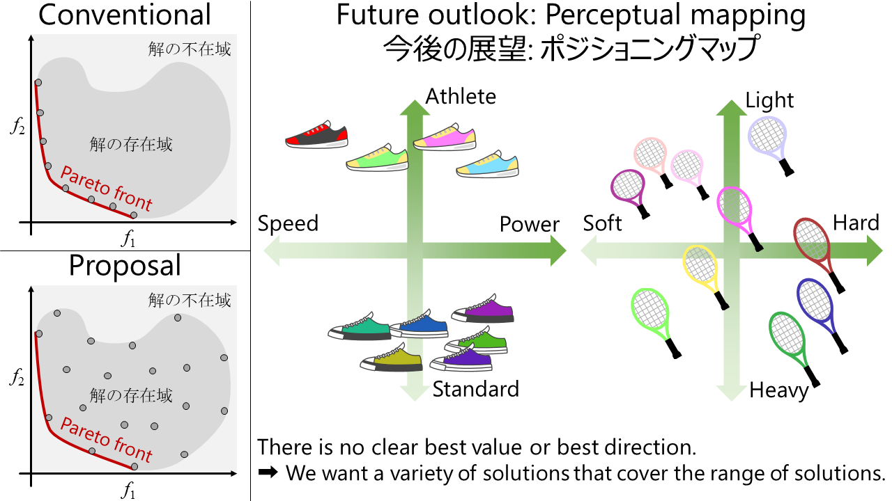
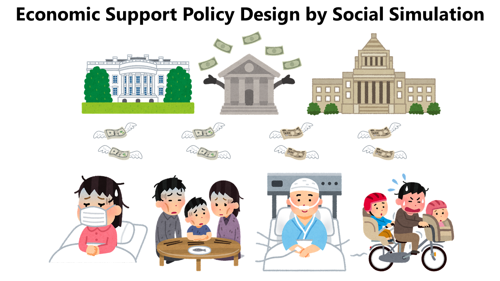

# 研究 (Research)
人工知能による最適化をメインフィールドに研究しています．特に興味・関心が高いのは確率的最適化，進化計算による多目的最適化ですが，ニューラルネットワークによる回帰，決定論的手法による空間充填，利用者に分かりやすい可視化など，幅広く研究に取り組んでいます．合成的に作られたベンチマーク問題の他，現実世界に近い問題も研究対象としています．ロボットアームの制御最適化，月着陸地点の選定，勤務シフト作成，ゲーム用乱数の設計，経済支援施策の設計の研究に取り組んだことがあります．  
研究課題の一部を，このページで紹介します．

## 終了した研究課題 (Completed research projects)
### 2017年2月-2018年3月: ロボットアームの制御最適化
自分の卒業研究です．指導教員から与えられた研究課題であり，企業との共同研究のため，詳細は割愛します．研究背景と目的が明確な点が，本研究の大きな強みであったと思います．一方，比較対象となる従来法が存在しない，途中で研究内容の大幅な変更が不可能，学外発表が不可能，修士以降での継続的な研究が不可能という特徴は，良し悪しの判断が分かれるところだと思います．同じ研究を3年間続けて修士で就職する学生が自分の周りでは多かったのですが，この研究をしていなければ，自分も周りと同じような道に進んでいたと思います．

キーワード，関連発表資料
- DE，kriging，NN，ハイパーパラメータ調整，単目的最適化
- 共同研究資料，卒業論文

### 2018年6月-2019年3月: 1点の解情報を利用する重みベクトル制御
自分が修士1年の時に取り組んだ研究課題です．学部4年の秋から修士での研究課題を探していたのですが，6月になるまで良い課題，実験結果に巡り合えませんでした．最終的に，指導教員のアドバイスに従い，MOEA/Dというアルゴリズムの性能改善に取り組むことになりました．与えられた課題に対し，自分は，1点の解情報を利用して重みベクトルを変更する静的法，動的法を考案しました．このシンプルながらも強力なアイディアが自身初の学外発表（海外での英語発表）で高く評価されたことが，博士課程進学を目指す大きなきっかけになりました．

キーワード，関連発表資料
- MOEA/D，NSGA-III，tWFG4，凹型・凸型PF，多目的最適化
- FAN2018，シンポジウム2018，JPNSEC-IWEC，BICT2019

### 2019年3月-2020年3月: 仮想目的ベクトル群を利用する重みベクトル制御1
自分が修士2年の時に取り組んだ研究課題です．MOEA/Dの性能をより向上させるためには，複数の解情報を活用して複雑に重みベクトルを制御せざるを得ないというのが，それまでの研究の結論でした．指導教員から，「大量の仮想目的ベクトルを生成し，それを利用する」というアイディアを頂き，研究がスタートしました．アイディアを実現するために外部アーカイブ，サンプリングなどの試行錯誤をしました．結果は修士論文としてまとめ上げ，無事に修士課程を修了することができました．本研究から，研究のベースをMATLAB，PlatEMOに本格的に切り替えました．

キーワード，関連発表資料
- MOEA/D，外部アーカイブ，サンプリング，凹型・凸型PF，多目的最適化
- 2019年C部門大会，16th研究会，修士論文

### 2019年9月-2020年3月: サンプリング法としての環境選択法
自分が修士2年の時に取り組んだ研究課題です．他の研究課題において，大量の解集合から少数の良い解集合を高速にサンプリングする必要がありました．そこで，サンプリング部分を組合せ最適化問題として切り離し，新しい研究課題としました．この問題はNP困難であり，真面目に取り組むと修士論文に間に合わなくなる危険性がありました．そこで，自分は多目的進化計算における環境選択法に着目し，その比較実験において優れていた方法をそのまま別の研究課題で利用することにしました．合計240コアのクラスタマシンをフル稼働させ，実験しました．

キーワード，関連発表資料
- サンプリング，環境選択法，組み合わせ最適化
- シンポジウム2019，CEC2020，修士論文付録

### 2020年2月-2020年4月: 単位超平面上に均一分布する点群
修士修了前後に取り組んだ研究課題です．自分が修士論文提出後，ぼんやり図を眺めていたら頭の中にアイディアが降ってきました．核心部分のコードは20行にも満たず，非常にシンプルです．タイミングが合ったので，国内学会での発表は行わずに難関国際会議GECCOに論文を投稿しました．提案法の実装には苦労しなかったのですが，全く同じものが存在しないか文献を探したり，他の手法を実装して比較実験の環境を整えるに苦労しました．また，実装はmatlabで組み込み関数やベクトル演算をフル活用しているのですが，それを原始的な疑似コードに落とし込むのにも苦労した記憶があります．

キーワード，関連発表資料
- Simplex-lattice design，Uniform mixture design
- GECCO2020

### 2020年11月-2020年12月: ゲームを楽しくする乱数の設計
進化計算コンペティション2020の課題です．前々から，このコンペには興味を持っていました．2020年からシステムが変更されて参加のハードルが下がり，タイミングも良かったので参加しました．自分は制約付き単目的最適化に取り組んだことが無かったので，問題の分析に力を注ぎました．分析の結果，問題知識を利用して工夫すると，単峰性の最適化問題として課題を取り扱えることに気が付きました．そこで，自分は進化計算ではなく，ランダムウォークを元にしたアルゴリズムでコンペに挑みました．結果は，単目的部門は10チーム中1位，多目的部門も9チーム中1位のスコアで，両部門のトップ賞を頂きました．

キーワード，関連発表資料
- ランダムウォーク，サロゲートアルゴリズム，制約付き単目的最適化
- 進化計算コンペティション2020

## 中断している研究課題 (Suspended research projects)
### 2019年2月-2019年3月: 解の存在域に関する分析（仮）
修士1年の最後に取り組んだ研究課題です．卒業研究として共同研究，単目的最適化に取り組んだ自分にとって，多目的最適化の問題設定，暗黙の了解は違和感を覚えるものでした．初めから明確な最良方向を仮定する考えに納得できませんでした．飛行機の翼の設計であれば，軽くて硬いほうが良いというのは納得できます．しかし，ラケットの設計であれば軽いもの，重いもの，柔らかいもの，硬いもの，人それぞれ好みがあり，どれが最適とは言えないと考えました．この考えは正しいと信じていますが，いくつかの技術的な課題，実問題の不足により中断している研究課題です．

キーワード，関連発表資料
- ポジショニングマップ
- 15th研究会

## 進行中の研究課題 (Ongoing research projects)
### 2021年10月-202X年XX月: 社会シミュレーションによる経済支援施策の設計
進化計算コンペティション2021の課題です．COVID-19による経済ショックと経済支援施策の影響を評価するシミュレータが競技者に与えられました．競技者は，「相対的貧困の世帯を減らす」，「世帯の収入減少を補償する」の2つを目的に，経済支援施策を設計しました．自分の結果ですが，単目的部門は11チーム中1位のスコアで，トップ賞を頂きました．多目的部門は10チーム中5位のスコアでしたが，発表内容が評価され，審査員特別賞を頂きました．

キーワード，関連発表資料
- 局所探索，バイナリ最適化
- 進化計算コンペティション2021
